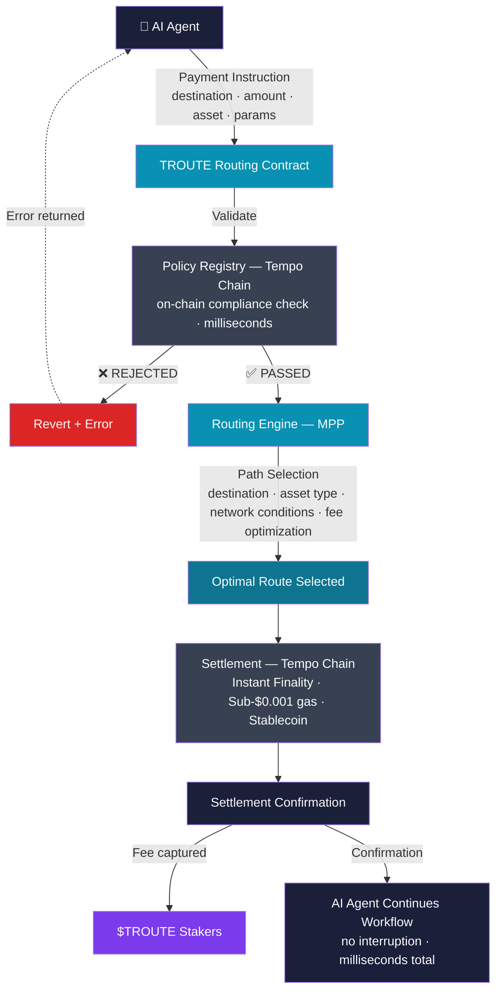

# The Solution

TROUTE replaces the human in the payment loop with a protocol.

When an AI agent needs to make a payment, it does not send a request to a human for approval. It sends a payment instruction to TROUTE.

TROUTE handles everything from that point forward.

## How It Works

**Step 1: Instruction**

The AI agent submits a payment instruction to the TROUTE routing contract. The instruction contains the destination, the amount, the asset, and any routing parameters specific to that transaction.

**Step 2: Validation**

TROUTE validates the instruction against the protocol's compliance rules via Tempo Chain's built-in Policy Registry. This happens on-chain in milliseconds. If the check fails, the transaction is rejected and an error is returned to the agent immediately.

**Step 3: Routing**

TROUTE routes the payment through the optimal path on Tempo Chain using MPP. The routing engine selects the most efficient settlement path based on destination, asset type, network conditions, and fee optimization.

**Step 4: Settlement**

The payment settles on Tempo Chain with instant finality. Gas fees are sub-$0.001, paid in stablecoins. No waiting. No confirmation delays.

**Step 5: Confirmation**

The AI agent receives a settlement confirmation and continues its workflow without interruption. A portion of the fee is captured and distributed to $TROUTE stakers.

The entire process happens in milliseconds. No human touches the transaction at any point.

This is what autonomous payments look like at machine speed.
